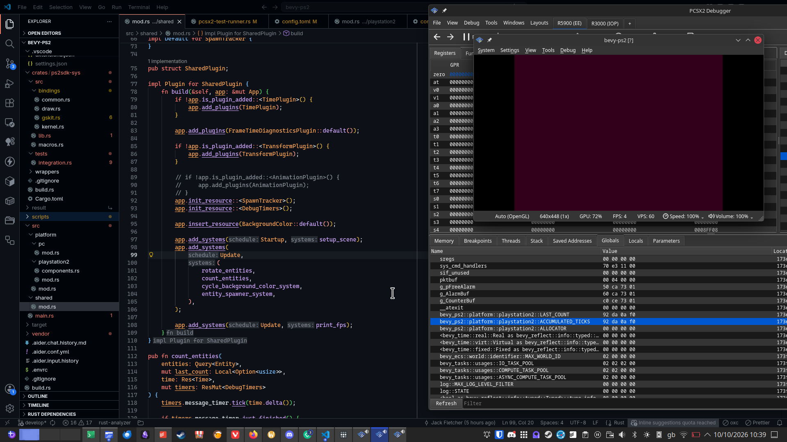
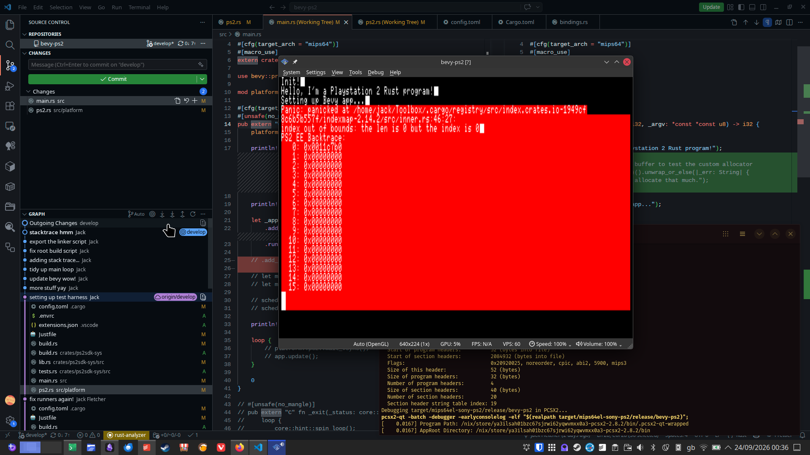

# Bevy 🤝 Playstation 2



This project aims to allow game logic to be developed using standard Bevy on PC, while being able to compile and deploy to a real PS2 (or PCSX2)

currently using the homebrew [PS2SDK][ps2sdk] and [gsKit][ps2dev-gskit] libraries. there's also [prussia] which provides a rusty API low level hardware things, maybe i'll use that later. 

I have no idea what I'm doing, I've gotten this far with a lot of trial and error. it does run though, but it only seems to work in debug mode.

## Project structure

The project is split into shared and platform code. the "PC" platform is intended to be regular Bevy, with all the usual render pipeline, materials, etc.

* **`src/shared/`**: 100% `no_std` cross-platform Bevy ECS logic. its's lowest common denominator stuff. Spawns marker components (e.g., `GameCamera`, `GameMesh`) instead of rendering bundles.
* **`src/platform/pc/`**: I haven't done much here yet. Native standard-library Bevy plugins (wgpu, windowing). Attaches Bevy's `Camera3dBundle` / `PbrBundle` to your shared marker components.
* **`src/platform/playstation2/`**: PS2 hardware backend. Uses a custom runner, allocator, renderer, etc
* **`crates/ps2sdk-sys/`**: Generated Rust bindings for the PS2SDK (kernel, draw, gskit, common).
* **`vendor/prussia/`**: Low-level PS2 hardware crates (DMA, INTC, runtime.) I haven't got this to link properly yet but it looks cool.
* **`scripts/`**: Utilities for packing ISOs and running PCSX2.
* 

## Status


- [x] #![no_std] Bevy ECS and App loop running fairly happily in PCSX2
- [x] Hardware-backed time using the EE COP0 Count register.
- [x] Static arena heap allocator (now `linked_list_allocator`).
- [x] Basic gsKit screen clearing and Bevy Color to PS2 register conversion.
- [x] Dual-platform component decoupling.
- [x] _the background cycles hue_
- [x] spawn too many entities and the fps goes down
- [x] TaskPool plugin is supposedly working. what can threads on PS2 even do though?
- [ ] very basic rendering of spinning cubes
- [ ] asset loading (i want a dancing neko arc)
- [ ] lazy CPU vertex skinning
- [ ] map some material RGB color from PS2/PC to the shared
- [ ] map controller input to Bevy's `ButtonInput<GamepadButton>` resource.
- [ ] networking (can I use a PS2 as a Wayland client?)

It would be really cool exercise to take a decompilation of an old game and start bringing chunks of it into Bevy. for example, re-implementing a materials system or high level game state stuff. then seeing how much of that can be ported to the PC platform in some way.

## Development environment

Use `nix develop` or [direnv](https://direnv.net/) to set up an environment with libraries and tools from the [PS2 homebrew toolchain](https://github.com/ps2dev/ps2dev).

Once your environment is set up, use [just] to run tasks.

```bash
# Use ps2-cargo wrapper for the usual tasks...
just ps2-cargo build
just ps2-cargo run
just ps2-cargo check
just ps2-cargo fix
just ps2-cargo test

# Use regular cargo to target PC
cargo run

# Run in PCSX2...
just ps2-run-elf
just ps2-run-iso
just ps2-debug-elf
```

isn't that nice?

## Nix (build/test)

PS2 builds are broken right now. linking? 

### PC targets

-   ```
    # Build and run PC engine
    nix run .#pc
    ```

- `nix build .#pc`

### Console targets

-   ```bash
    # Build and run in PCSX2
    nix run
    ```

-   ```bash
    # Build and run in PCSX2 (with debugger)
    nix run .#debugger
    ```

- `nix build .#elf`
- `nix build .#iso`

## Targets

### [[./mips64el-sony-ps2.json]]

mips64el-sony-ps2.json: Current active target. Uses mips2 instruction set and n32 ABI Builds and links against PS2SDK libs.

### [[./mipsel-sony-ps2.json]]

Fails to link. ignore this one. maybe should try using Prussia's [[./vendor/prussia/ps2.json]] or something.

---




[ps2sdk]: https://github.com/ps2dev/ps2sdk
[ps2dev-gskit]:  https://github.com/ps2dev/gsKit
[prussia]: https://github.com/Ravenslofty/prussia
[just]: https://just.systems/man/en/introduction.html
